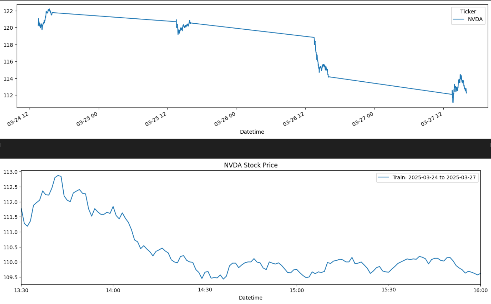
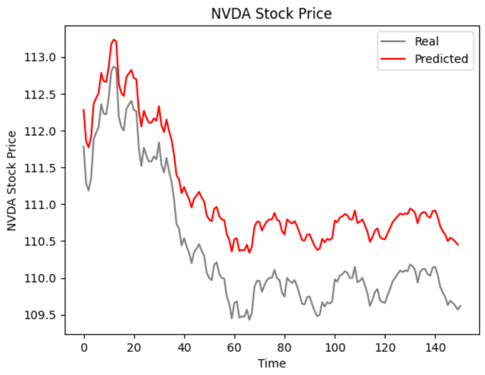

# Stock Market Prediction using time-series forecasting on an LSTM model

### Goal: Predict day-to-day changes in the stock market and display relevant information in a browser interface.

### Method used: Time-series forecast with an RNN and an LSTM.

### Frameworks:
- Alpaca API: Real-time prediction and analysis
- YFinance API: Model training and evaluation
- Socket.IO: Real-time system communication

### Sample Prediction:
The following was taken from my model training page where I fed my model data ranging from minute-to-minute data between 03/24/2025 - 03/29/25. This interval was specifically taken between this time to represent the week right before the testing week. Unfortunately, yFinance does not permit me to gather minute-to-minute data for over the past 8 days which is why I could only use this interval at most (I cannot go further behind).
<figure>
    

        
        
    

    <figcaption>This data was in the form of the stock prices for NVDA (Nvidia) in which I accurately predicted the resulting trends that appeared in the week of March 29th, 2025 (currently this week). </figcaption>
</figure>

### Interface In-Action
The following was taken from my model deployment page in which I run a front-end application that displays a prototype of how the model would be applied. Ideally, the predictions would be fairly similar to the actual stock values however, I struggled to get the right scale for my model (-5 as opposed to -0.5) which is why, when my model predicts on the scaled value, the outcome is so skewed. 

### Results and Future Considerations
Throughout this project, I gained exposure to the more technical side of the stock market. 